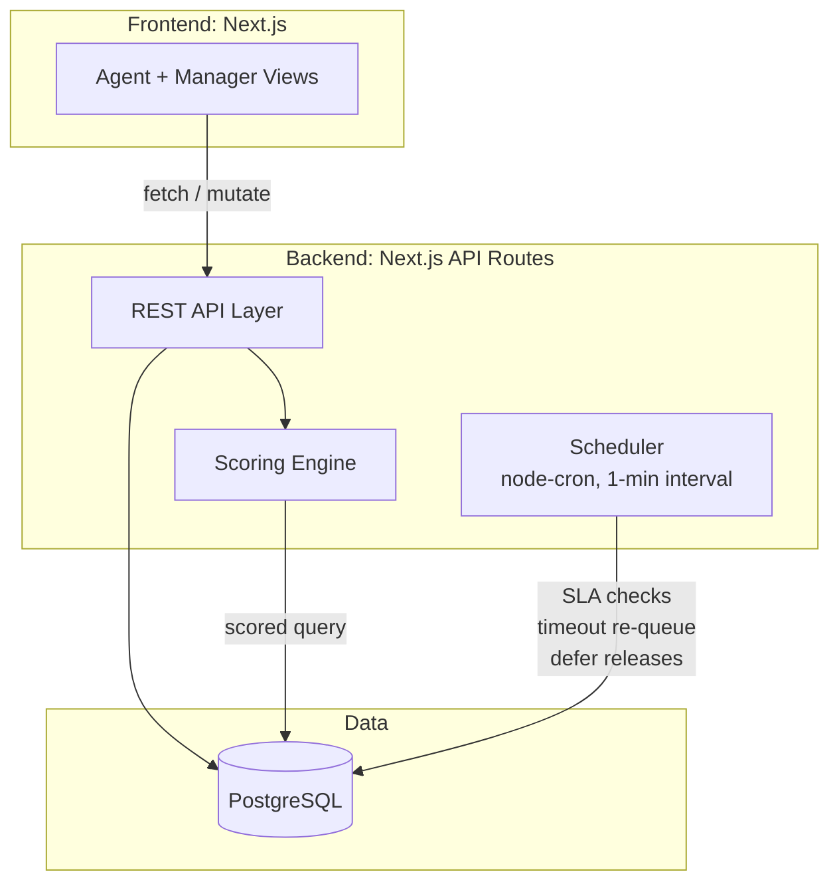
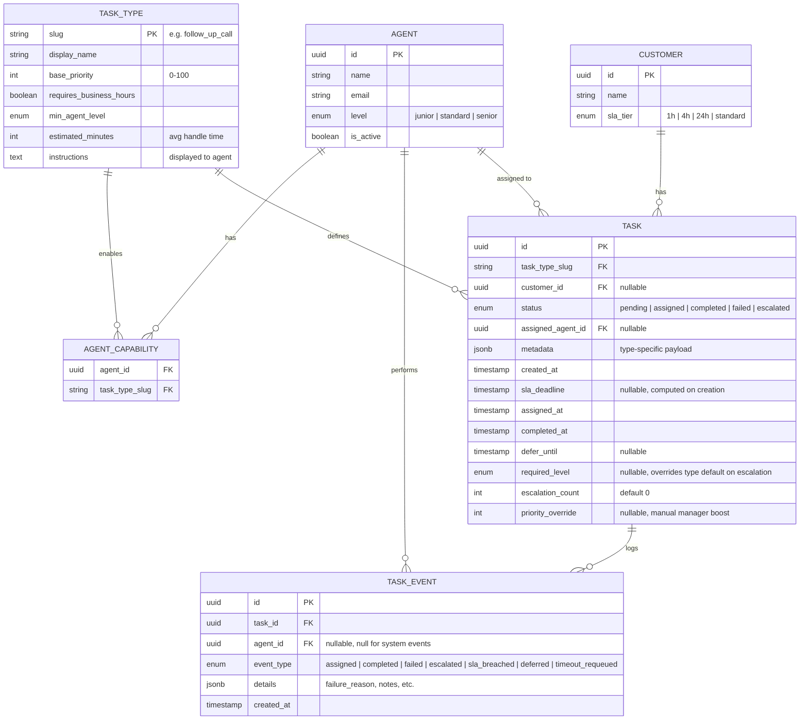
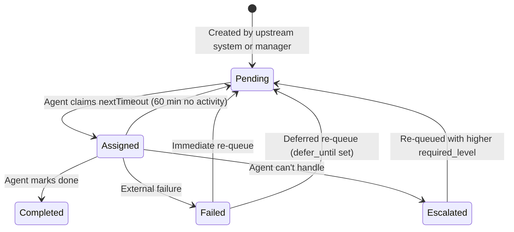

## Challenges

- Priority has multiple dimensions && time dependent. SLA deadlines, task urgency, agent skills, and business hours windows all compete with each other.
- Tasks fail for external reasons and each failure mode needs a different response of defer, retry, or escalate.
- If agents pick their own tasks they cherry pick easy work cuz ppl are lazy and SLA critical tasks sit. The system needs to assign work.
- New task types get added regularly and adding one shouldn't require a code deploy.

---

## Architecture



Why I chose **Next.js** + **PostgreSQL** + **Prisma** as the architecture: 

If I'm not wrong this is consistent with some of the old stack I found at https://github.com/develop-health with Next.js in the insurance-checker app && Postgres HA on Fly.io. It's also a stack I'm super familiar with so it's much easier for me to implement. `FOR UPDATE SKIP LOCKED` handles concurrent task claiming without a separate queue which is huge so thanks PostGRES for solving this problem for me. And I'd use **Prisma** for type-safe ORM as it's easier to scale then constantly writing SQL (unless thats what you guys do in which case I can also do that). No message queue at this scale cuz their isn't enough agents working concurrently, this can be revisited if we grow 10x. Polling at 30s intervals, not WebSockets. Deploy on Fly.io alongside existing infrastructure.

---

## Data Model



**Notable choices:**
- **`metadata` (JSONB)**  Every task type needs different info (fax number for faxes, phone number for calls, drug name for PA reviews, etc.). Instead of making a separate table for each type, I just shove it all into one flexible JSON field. Zod checks it on the way in so garbage data doesn't sneak through. Use JSONB so the database can actually index and query inside it unlike a plain text field where the DB has no idea what's in there.
- **`TASK_TYPE` as a table** When addind new tasks just add a row to the database. No code changes no redeploy no bothering engineering. I use the `instructions` field to tell agents what to do for that type.
- **`defer_until`** Sometimes a task fails but you can't retry it right now like the insurance phone line is closed for the night. Instead of inventing a whole new deferred status, just slap a timestamp on it that says "don't touch this until X time." It's still pending, just hidden from the queue until then.
- **`TASK_EVENT`** Every time anything happens to a task (assigned, completed, failed, escalated) I log it. Never delete only append. This gives managers a full paper trail and makes it easy for me to build reports or debug weird issues later.
- **`priority_override`** Let managers manually bump any task to the front of the line. Maybe a VIP customer called in, maybe something's about to blow up just crank the score and it floats to the top.

---

## Task Scoring Engine

### Eligibility filters that are applied first

```sql
WHERE status = 'pending'
  AND (defer_until IS NULL OR defer_until <= NOW())
  AND (required_level IS NULL OR required_level <= :agent_level)
  AND task_type_slug IN (:agent_capable_types)
  -- don't show business-hours tasks if it's after hours
  AND (NOT task_type.requires_business_hours OR :is_business_hours)
```

### Scoring formula

```typescript
function scoreTask(task: Task, now: Date): number {
  // how close are we to blowing the SLA? 0 = tons of time, 1 = right at the edge
  let slaUrgency = 0;
  if (task.slaDeadline) {
    const totalWindow = task.slaDeadline - task.createdAt;
    const remaining  = task.slaDeadline - now;
    slaUrgency = Math.max(0, Math.min(1, 1 - remaining / totalWindow));

    // less than 15 min left? drop everything, this one goes first
    if (remaining < 15 * 60 * 1000 && remaining > 0) return 1000;
    // already past the deadline but still top priority gotta limit the damage
    if (remaining <= 0) return 999;
  }

  // how important is this type of task in general (normalized to 0-1)
  const typePriority = task.taskType.basePriority / 100;

  // how long has this been sitting around? older stuff floats up so nothing rots forever
  const hoursWaiting = (now - task.createdAt) / (1000 * 60 * 60);
  const ageFactor = Math.min(hoursWaiting / 24, 1);

  // it's getting late and this task needs business hours boost it before the window closes
  let windowBonus = 0;
  if (task.taskType.requiresBusinessHours && isBusinessHours(now)) {
    const hoursUntilClose = getHoursUntilBusinessClose(now); // 5pm ET
    if (hoursUntilClose < 2) windowBonus = 1;
    else if (hoursUntilClose < 4) windowBonus = 0.5;
  }

  // mash it all together
  const score = (slaUrgency   * 40)
              + (typePriority  * 30)
              + (ageFactor     * 20)
              + (windowBonus   * 10)
              + (task.priorityOverride ?? 0);  // manager can juice this manually

  return score;
}
```

The hard override at <15 min ensures near breach tasks always win. The window bonus handles "it's 4:45pm and we have calls to make." Age factor prevents low priority tasks from starving forever. Weights are config driven and changeable without deploys.

**What happens when two agents ask for a task at the same time?** This is the one thing that could get weird if Agent A and Agent B both hit get next task at the exact same moment they could grab the same one. I mentioned this early on in the architecture section though that Postgres already solves this for us with `FOR UPDATE SKIP LOCKED`. It locks the top scored row for the first agent and if the second agent sees it's locked, it just skips to the next task.

**Note:** Because is a Postgres-specific feature the localhost current SQLite setup doesn't support row-level locking like this. I just jerryrigged it and worked around it by checking `status = 'pending'` before updating which is should be fine for a demo but would need Postgres for real concurrent production traffic.

---

## Task Lifecycle



### Failure handling

The agent selects a **failure reason** which determines re-queue behavior:

| Failure Reason | System Response |
|---|---|
| PBM/insurance phone closed | `defer_until` = next business day 9am ET |
| Website/portal down | `defer_until` = 30 minutes from now |
| Illegible/incomplete fax | Escalate to senior agent |
| Need more information | Escalate + flag for manager review |
| Other (free-text) | Re-queue immediately, manager notified |

This mapping is configurable && managers can adjust retry timing without code changes.

**Escalation** bumps `required_level` up one tier and re-queues. Tasks escalated twice auto flag for manager review.

**Timeout:** tasks assigned >60 min with no activity are returned to `pending`. A "still working?" prompt at 45 min lets agents reset the timer.

---

## UI Design

To see UI design spin up the localhost, it's worth it z promise (try and find the easter egg):
```
cd app && npm run dev
```

---

## Implementation Phasing

**First:** Schema, scoring engine, agent view (claim, complete, fail), manual task creation, SSO auth. Enough to get agents actually working through the system.

**Then ops visibility:** Manager dashboard, escalation flow, failure reasons with configurable re-queue, `defer_until` + scheduler, audit log.

**Then polish:** Reporting (SLA compliance %, handle times), Slack alerts on breaches, API for upstream task creation, tunable scoring weights, bulk operations.

---

## Tradeoffs & Decisions

| Decision | Alternative Considered | Reasoning |
|---|---|---|
| **Postgres as queue** | None. Postgres is the goat. | `FOR UPDATE SKIP LOCKED` handles concurrent claims correctly. If we 10x scale, we can add a queue layer without changing the data model. |
| **System-assigned tasks** | Agent self-selects from list | Self-selection leads to cherry picking && agents will want to do easy tasks and SLA-critical work will sit. This is the #1 operational risk. The system assigns && agents can skip (with a logged reason) if they're realling feeling lazy. |
| **JSONB metadata** | Per-type tables | New task types ship frequently and JSONB means a new type is a row insert + a Zod schema instead of a whole migration. Tradeoff though: no DB-level enforcement |
| **Next.js monolith** | None. React.js is my all and everything | Everything lives in one repo — frontend, API, types, all of it. No juggling separate deploys or keeping two repos in sync. If something eventually gets big enough to justify splitting out, I can do that later, but right now it'd just be extra overhead for no reason. |
| **Computed `sla_deadline`** | Recalculate dynamically | Calculate the deadline once when the task is created and just store it. Way easier to query and index than recalculating it every time. The tradeoff is if you change a customer's SLA tier, old tasks keep their original deadline |
| **`defer_until` on task** | Separate "deferred" status | Didn't want to add a whole new status just for "come back to this later." Instead just stick a timestamp on the task that says "ignore this until then." It's still technically pending, just invisible to the queue. |

**Assumptions:**
- Tasks get created by some upstream system or by managers manually
- Auth is already handled
- Agents already have their own tools for making calls, sending faxes, etc. This system just tells them what to work on and gives them the context they need.
- SLA deadlines are just straight clock hours for now. If business hours only SLAs are needed like "4 business hours, not calendar hours", that's a tweak to the deadline calculation.
